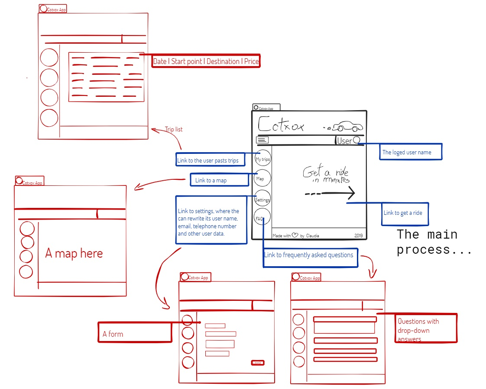

      
Cotxox Report

# Index

Design outline ........................................................................................................................................................................................... 1
  
Motivations ................................................................................................................................................................................................. 2

Development .............................................................................................................................................................................................. 3

# 1. Design Outline

 

I need to build a back-end to implement the main process. So I will build the static views of the Cotxox app for this project.

  

# 2. Motivations

My principal motivation to make this project was to put together all the _Languages for viewing_ knowledge adquired along this course. And I choose the Cotxox App for this project because we made the logic part in the Programming subject; I thought it could be a goot idea to create the front-end part and the database to finally connect all we've been working in all subjects.

# 3. Development
